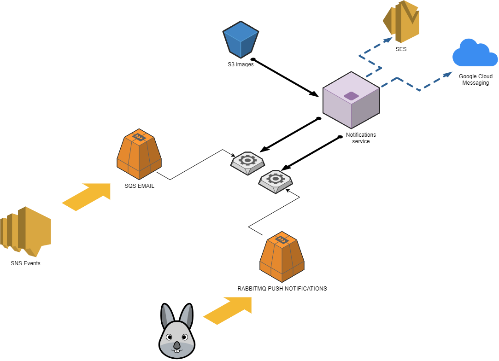

# Micro-servicio NOTIFICATIONS

## Descripcion

Micro servicio encargado de realizar notificaciones por email

## Diagrama

## Inicializacion

* Copiar el archivo example.env y renombrarlo a .env 
* Completar el contenido del mismo con todas las variables de entorno. 
* Tanto si se quiere inicializar el servicio de manera local o con docker se debe levantar el servicio de redis para la mensajeria.

Correr el comando:
> `docker-compose -f docker-compose.data.yml -d`

* ### Docker
Para levantar el servicio con docker correr el comando:\
> `docker-compose up --build`

* ### Local
1) Tener instalado node > 14 y su respectiva version de npm.
2) Instalar las dependencias:
    - > `npm install`
3) Para levantar el servicio correr el comando:

    - > `npm start`

## Variables de entorno

### REDIS QUEUE

El servicio es un consumer el cual esta escuchando constantemente una cola de REDIS definida a traves de las variables de entorno.

* REDIS_IP: Ip de la instancia de redis a utilizar.

    Ej:
        
         127.0.0.1

* REDIS_PORT: Puerto donde esta levantado redis.

    Ej:
    
         63795

* EMAIL_QUEUE: Nombre de la cola definida para contener los jobs de los emails

    Ej:
       
        notification-email-develop
### Imagenes en S3

Actualmente el servicio utiliza imagenes guardadas en un bucket S3 para poder enviar los mails correctamente.
Por lo tanto se debe crear un bucket destinado a esto y las imagenes deben respetar el nombre con el que estan creadas en el ambiente de dev.

La variable `IMAGES_BUCKET` contiene la direccion base a la carpeta donde estan contenidas dichas imagenes.

## Dependencias del servicio

| Nombre |Versión |
| ------------ | ------------ |
|@sentry/node |  ^6.13.2 |
|@sentry/tracing | ^6.13.2 |
|console-stamp | ^3.0.3 |
|cors | "^2.8.5 |
|dotenv | ^8.2.0 |
|express | ^4.17.1 |
|express-validator | ^6.12.1 |
|nodemailer | ^6.6.1 |
|nodemon | ^2.0.7 |

## Metodos disponibles para envio de mails
|Método|Parámetros requeridos | Descripción |
| ------------ | ------------ |------------ |
|sendForgotPasswordEmail | email, token, url | Envia un email de recuperacion de contraseña |
|sendAccountDisabledEmail | email, date_next_attempt, time_next_attempt | Envia mail de cuenta deshabilitada |
|sendlockedAccountEmail | email | Envia mail de cuenta bloqueada |
|sendWelcomeEmail | email, name, surname | Envia mail de bienvenida al finalizar el onboarding |
|sendVerificationEmail | email, url, code, deleteUrl | Envia mail para verificar el mail del usuario |
|sendRegistrationSuccessEmail | url, email | Envia mail de registro exitoso |
|profileImageError | name, surname, phone, email | Envia mail a backoffice por errores subiendo imagenes a s3 |
|sendUnlockedUserEmail | email, url | Envia mail de desbloqueo de cuenta |

## Tests

Para correr los tests asegurarse de configurar la variable de entorno `RECIPIENT_FOR_TESTING`, porque los emails seran enviados a esa direccion.

Si se necesita correr todos los tests en el ambiente local utilizar el comando:

> `docker exec wallet_notification npm run test`

En caso de necesitar correr un test en especifico utilizar:

> `docker exec wallet_notification npm test -- -t "<nombreDelTest>"`

Por Ej:
> `docker exec wallet_notification npm test -- -t "will send unlock user email"`

## Logica y enfoque
>TODO

## Troubleshooting
>TODO

